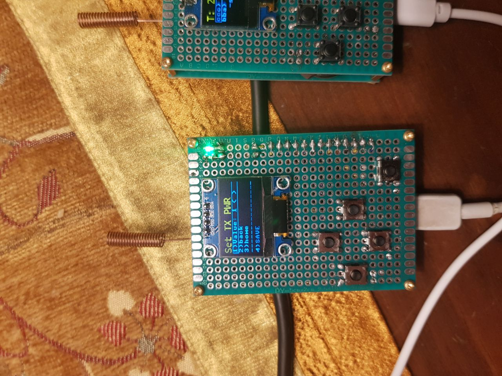
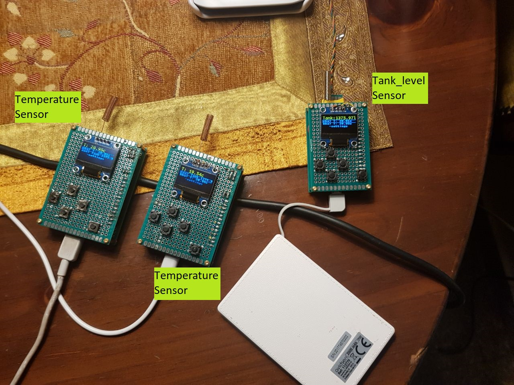
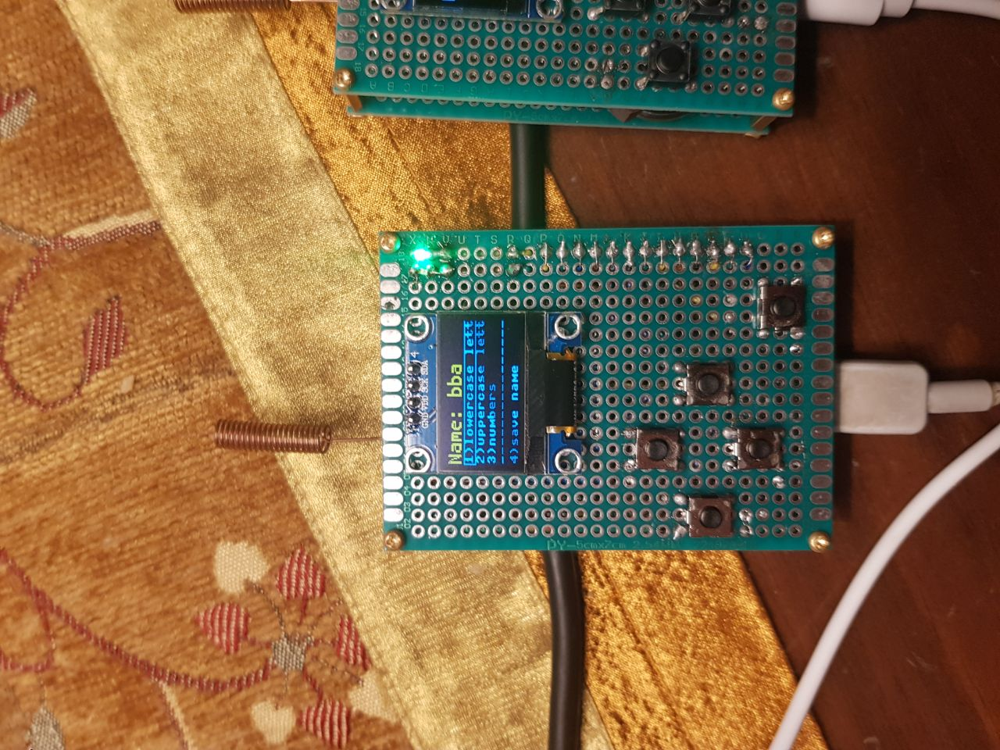

# Silver_Mhon
A set of devices with a built-in display, buttons, and sensors, that exchange information via LoRa about the sensors to display the data on screen and allow for monitoring of the home.

WORK IN PROGRSS!

